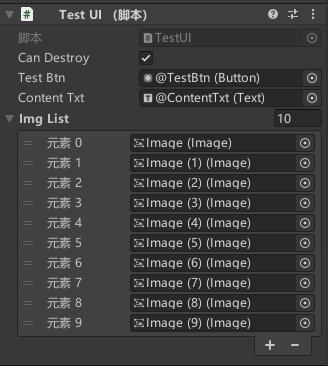
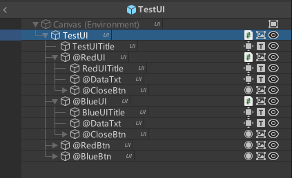

# 特点
```
(1) 一个简单易用的异步UI框架  
(2) 兼容多种资源管理系统（Addressable、YooAssets等）  
(3) 支持自动引用，暴露在Inspector面板上的字段会自动从Hierarchy面板引用  
(4) 支持子UI，UI元素
(5) 支持自定义脚本模板
(6) 支持对UI面板的销毁控制，使内存优化更方便
```
# 如何使用
创建UIFrame预制体，可参考如下结构  
Canvas的渲染模式要设置成`屏幕空间-摄像机`  
PanelLayer和WindowLayer的RectTransform要设置成全屏的(左，右，顶部，底部都要为0)  
```
--UIFrame         (RectTransform、Canvas、CanvasScaler、GraphicRaycaster、UIFrame)  
------UICamera    (Transform、Camera、AudioListener)
------PanelLayer  (RectTransform)
------WindowLayer (RectTransform)
------EventSystem (Transform、EventSystem、StandaloneInputModule)
```

初始化
```C#
private void Awake()
{
    // 注册资源请求释放事件
    UIFrame.OnAssetRequest += OnAssetRequest;
    UIFrame.OnAssetRelease += OnAssetRelease;
    // 注册UI卡住事件
    // 加载时间超过0.5s后触发UI卡住事件
    UIFrame.StuckTime = 0.5f;
    UIFrame.OnStuckStart += OnStuckStart;
    UIFrame.OnStuckEnd += OnStuckEnd;
}

// 资源请求事件，name为Prefab的名称。如：MainUI、TestUI
// 可以使用Addressables，YooAssets等第三方资源管理系统
private async void OnAssetRequest(string name, Action<GameObject> response)
{
    if (!handles.ContainsKey(name))
    {
        var handle = Addressables.LoadAssetAsync<GameObject>(name);
        await handle.Task;
        handles[name] = handle;
    }
    response.Invoke(handles[name].Result);
}

// 资源释放事件
private void OnAssetRelease(string name)
{
    if(handles.ContainsKey(name))
    {
        handles[name].Release();
        handles.Remove(name);
    }
}

private void OnStuckStart(string name)
{
    // UI初始化加时间过长，卡住了,打开转圈面板
}

private void OnStuckEnd(string name)
{
    // 不卡了，关闭转圈面板
}
```
创建一个UI脚本，继承自UIComponent<T>
并挂到与脚本同名的Prefab中  

```C#
public class TestUIProperties : UIProperties
{

}

public class TestUI : UIComponent<TestUIProperties>
{
    // 暴露在Inspector面板上的字段会自动引用
    // 只需让Hierarchy面板上的对象的名称与字段名称保持一致（不区分大小写），并以@开头
    // 如： 
    // @Content
    // @CloseBtn
    // @MainBtn
    // @Img

    [SerializeField] private Text content;
    [SerializeField] private Button closeBtn;
    [SerializeField] private Button mainBtn;
    [SerializeField] private Image img;

    // 初始化方法，生命周期内仅调用1次
    // 资源加载，网络请求，等耗时操作放在此处执行
    // 加载的资源或句柄请在OnDestroy方法内回收
    public async override Task Initialize()
    {
        await UnityWebRequest.Get("XXX").SendWebRequest();
        await Task.Delay(1000);
        var handle = Addressables.LoadAssetAsync<Sprite>("XXX");
        await handle;
        // ......... 
        // .........
    }

     // 注册事件，当UI打开时调用
    public override void AddListeners()
    {
        closeBtn.onClick.AddListener(OnClose);
        mainBtn.onClick.AddListener(OnMain);
    }

    // 注销事件，当UI关闭时调用
    public override void RemoveListeners()
    {
        closeBtn.onClick.RemoveListener(OnClose);
        mainBtn.onClick.AddListener(OnMain);
    }

    // 刷新UI，UI数据更新放到此处执行
    public override void Refresh()
    {
        content.text = $"Sender = {this.Properties.Sender}";
    }

    private void OnMain()
    {
        // UIFrame.ShowPanel<MainUI>(new MainUIProperties());
        // 或
        // UIFrame.OpenWindow<MainUI>(new MainUIProperties());
    }

    private void OnClose()
    {
        // UIFrame.CloseWindow<TestUI>();
        // 或
        // UIFrame.HidePanel();
    }

    private void OnDestroy()
    {
        // handle.Release();
    }
}
```
使用以下方法对UI进行控制  
Panel由栈进行控制，显示下一个Panel时会将当前Panel关闭，隐藏当前Panel时会显示上一个Panel  
Window一般用作弹窗，它显示在Panel之上，使用OpenWindow和CloseWindow进行控制  
一个UI不能既由充当Panel又充当Window，即不能使用ShowPanel，HidePanel方法的同时又使用OpenWindow，CloseWindow  
```C#
// 显示Panel
UIFrame.ShowPanel<TestUI>(new TestUIProperties());
// 隐藏Panel
UIFrame.HidePanel();
// 打开Window
UIFrame.OpenWindow<TestUI>(new TestUIProperties());
// 关闭Window
UIFrame.CloseWindow<TestUI>();
// 刷新UI
UIFrame.Refresh<TestUI>();
```
# UIComponent生命周期  
以TestUI为例，TestUI继承自`UIComponent<T>`  
```
TestUI.Initialize -> TestUI下所有继承自UIComponent组件的Initialize -> TestUI.AddListeners -> TestUI下所有继承自UIComponent组件的AddListeners -> TestUI.Refresh -> 同理的Refresh -> TestUI.RemoveListeners -> 同理的RemoveListeners 
``` 
`Initialize`方法在`Awake`之后，`Start`之前执行  
因为`Initialize`是耗时操作，所以`AddListeners`、`Refresh`都在`Update`之后执行  
```
注意：内部使用的是GetComponentsInChildren方法，所以未激活的子物体将不执行上述过程  
```
# 自动引用
首先创建`UIFrameSetting`，右键菜单 -> 创建 -> UIFrame -> UIFrameSetting  
可以将`UIFrameSetting`这个文件放到其他位置，而不是必须要在Assets目录下  
开启UIFrameSetting中的Auto Reference  
如果要禁用自动引用，只需关闭UIFrameSetting中的Auto Reference  
有如下脚本，暴露在Inspector面板上的字段有`testBtn`，`contentTxt`，`imgList`
```C#
public class TestUI : UIComponent<TestUIProperties>
{
    [SerializeField] private Button testBtn;
    [SerializeField] private Text contentTxt;
    [SerializeField] private List<Image> imgList;
}
```
只需将Hierarchy要自动引用的物体的名称改成字段的名称（不区分大小写），并且以@开头  
改完名称后不需要其他任何操作，在Prefab保存的时候会自动将Hierarchy面板上的值赋值到Inspector面板上  
在开启自动引用时被引用的字段将被控制，你无法删除或将该字段的值修改成其他值  
  
对与List类型，只需修改成元素父物体的名称即可，例如`ImgList`  
  

# 子UI，UI元素
有时一个面板上会有多个子面板和一些UI元素，希望能在显示一个UI时，能同时将子面板和UI元素进行初始化和刷新  
例如，TestUI有RedUI和BlueUI这2个子UI，RedUI和BlueUI都有一个Text组件，显示Data = xxx  
希望在显示TestUI时对RedUI和BlueUI进行初始化和刷新，更新Data = xxx的值，并且能通过TestUI上的2个按钮打开子UI，子UI上带一个关闭按钮，能将自己关闭  
  
TestUI面板的结构如下  
TestUI挂载`TestUI`脚本，引用@RedUI、@BlueUI、@RedBtn、@BlueBtn  
@RedUI挂载`RedUI`脚本，引用@DataTxt、@CloseBtn  
@BlueUI挂载`BlueUI`脚本，引用@DataTxt、@CloseBtn  
  
在调用`UIFrame.ShowPanel<TestUI>`或`UIFrame.OpenWindow<TestUI>`时，执行如下过程  
TestUI.Initialize -> RedUI.Initialize -> BlueUI.Initialze -> TestUI.AddListeners -> RedUI.AddListeners -> BlueUI.AddListeners -> TestUI.Refresh -> RedUI.Refresh -> BlueUI.Refresh  
原理：调用`UIFrame.ShowPanel`、`UIFrame.HidePanel`或`UIFrame.OpenWindow`（即显示一个面板时），会使用`GetComponentsInChildren`方法获得该UI内所有继承自`UIComponent<T>`的组件，并执行他们的`Initialize`、`AddListeners`、`Refresh`、`RemoveListeners`方法  
```
注意：继承自UIComponent<T>的组件都有Show和Hide方法，该方法不受UIFrame的控制，Show和Hide直接控制gameObject的Active，并执行AddListeners或RemoveListeners方法，可按需要重写Show和Hide方法。Panel和Window使用UIFrame来控制，子UI或UI元素使用Show和Hide来控制  
```
```C#
public class TestUI : UIComponent<UIProperties>
{
    [SerializeField] private RedUI redUI;
    [SerializeField] private BlueUI blueUI;
    [SerializeField] private Button redBtn;
    [SerializeField] private Button blueBtn;

    public override async Task Initialize()
    {
        Debug.Log("TestUI Initialize");
        await Task.CompletedTask;
    }

    public override void AddListeners()
    {
        redBtn.onClick.AddListener(redUI.Show);
        blueBtn.onClick.AddListener(blueUI.Show);
    }

    public override void RemoveListeners()
    {
        redBtn.onClick.RemoveListener(redUI.Show);
        blueBtn.onClick.RemoveListener(blueUI.Show);
    }

    public override void Refresh()
    {
        redUI.Properties = new RedUIProperties() { Data = "Red" };
        blueUI.Properties = new BlueUIProperties() { Data = "Blue" };
    }
}
```
```C#
public class RedUIProperties : UIProperties
{
    public string Data;
}

public class RedUI : UIComponent<RedUIProperties>
{
    [SerializeField] private Text dataTxt;
    [SerializeField] private Button closeBtn;

    public override Task Initialize()
    {
        Debug.Log("RedUI Initialize");
        return Task.CompletedTask;
    }

    public override void AddListeners()
    {
        closeBtn.onClick.AddListener(this.Hide);
    }

    public override void RemoveListeners()
    {
        closeBtn.onClick.RemoveListener(this.Hide);
    }

    public override void Refresh()
    {
        dataTxt.text = $"Data = {Properties.Data}";
    }
}
```

# 自定义脚本模板
首先创建`UIFrameSetting`，右键菜单 -> 创建 -> UIFrame -> UIFrameSetting  
可以将`UIFrameSetting`这个文件放到其他位置，而不是必须要在Assets目录下  
右键菜单可以看到`创建UIComponent`，点击后会在Assets目录下创建一个`UIFrameSetting`（如果没有的话） 
将模板文件(.txt)拖放到UIFrameSetting中，模板文件可以参考`UIComponentTemplate.txt`  
文件名将会替换模板文件中的`#SCRIPTNAME#`  

```
using System.Collections;
using System.Collections.Generic;
using System.Threading.Tasks;
using UnityEngine;
using UnityEngine.UI;
using Feif.UIFramework;

public class #SCRIPTNAME#Properties : UIProperties
{

}

public class #SCRIPTNAME# : UIComponent<#SCRIPTNAME#Properties>
{
    public override Task Initialize()
    {
        return Task.CompletedTask;
    }

    public override void AddListeners()
    {
    }

    public override void RemoveListeners()
    {
    }

    public override void Refresh()
    {
    }
}
```

# UI的销毁控制
  
继承自`UIComponent<T>`的脚本都会在Inspector面板上暴露出`Can Destroy`属性  
当启用`Can Destroy`时，会在调用`UIFrame.HidePanel`或`UIFrame.CloseWindow`时销毁该物体，并释放该物体引用的资源  
当禁用`Can Destroy`时，调用`UIFrame.HidePanel`或`UIFrame.CloseWindow`时，只是将该物体的`Active`设为false  
该字段可以在运行时通过代码来控制  
```
注意：启用Can Destroy时，关闭面板后再打开面板会执行Initialize方法  
推荐做法：频繁使用的UI禁用该选项以提升UI的打开速度。不频繁使用的UI，或占内存比较大的UI启用该选项以优化内存  
```