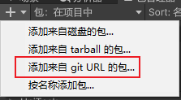
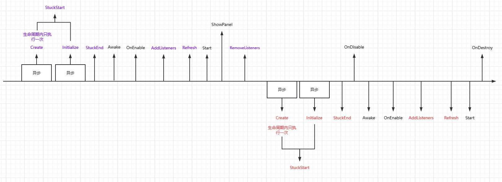
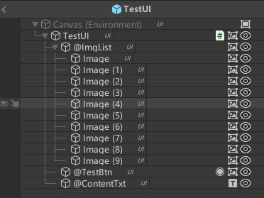
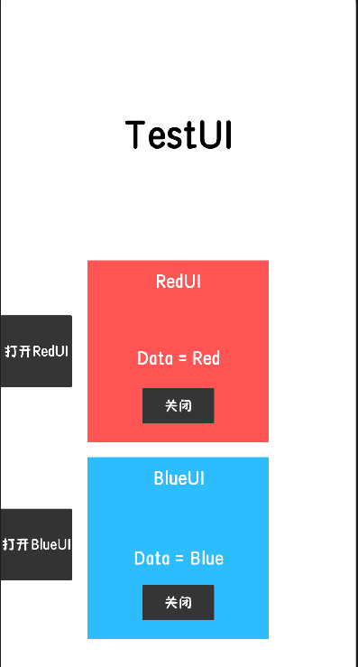
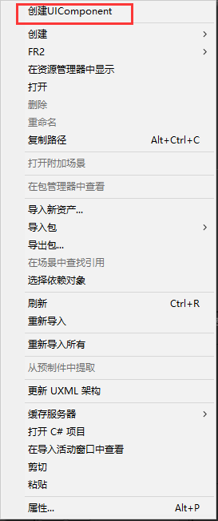
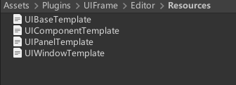
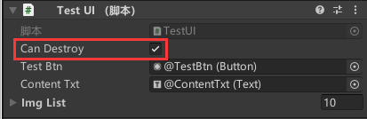

# 特点
```
(1) 一个简单易用的异步UI框架  
(2) 兼容多种资源管理系统（Addressable、YooAssets等）  
(3) 支持自动引用，暴露在Inspector面板上的字段会自动从Hierarchy面板引用  
(4) 支持子UI，子子UI，子子子UI......  
(5) 支持自定义脚本模板  
(6) 支持对UI面板的销毁控制，使内存优化更方便  
(7) 强大的扩展性,可以通过自定义事件，来支持自动事件绑定，例如自动绑定按钮的点击事件  
(8) 支持多层UI管理  
(9) 内置定时器  
```
# 安装

## 方案一

使用git URL

```
https://github.com/feifeid47/Unity-Async-UIFrame.git
```


  

## 方案二

导入unitypackage

# 如何使用

创建UIFrame预制体，可参考如下结构  
Canvas的渲染模式要设置成`屏幕空间-摄像机`  
```
--UIFrame         (RectTransform、Canvas、CanvasScaler、GraphicRaycaster、UIFrame)  
------UICamera    (Transform、Camera、AudioListener)
------UILayers    (RectTransform)
------EventSystem (Transform、EventSystem、StandaloneInputModule)
```

初始化
```C#
private void Awake()
{
    // 注册资源请求释放事件
    UIFrame.OnAssetRequest += OnAssetRequest;
    UIFrame.OnAssetRelease += OnAssetRelease;
    // 注册UI卡住事件
    // 加载时间超过0.5s后触发UI卡住事件
    UIFrame.StuckTime = 0.5f;
    UIFrame.OnStuckStart += OnStuckStart;
    UIFrame.OnStuckEnd += OnStuckEnd;
}

// 资源请求事件，type为UI脚本的类型
// 可以使用Addressables，YooAssets等第三方资源管理系统
private async Task<GameObject> OnAssetRequest(Type type)
{
    if (!handles.ContainsKey(type))
    {
        var handle = Addressables.LoadAssetAsync<GameObject>(type.Name);
        await handle.Task;
        handles[type] = handle;
    }
    return handles[type].Result;
}

// 资源释放事件
private void OnAssetRelease(Type type)
{
    if(handles.ContainsKey(type))
    {
        handles[type].Release();
        handles.Remove(type);
    }
}

private void OnStuckStart()
{
    // UI初始化加时间过长，卡住了,打开转圈面板
}

private void OnStuckEnd()
{
    // 不卡了，关闭转圈面板
}
```
创建一个UI脚本，继承自UIComponent<T>
并挂到与脚本同名的Prefab中  

```C#
public class UITestData : UIData
{

}

[PanelLayer]
public class UITest : UIComponent<UITestData>
{
    [SerializeField] private Image img;
    [SerializeField] private Text content;
    [SerializeField] private Button close;

    // 创建时调用，生命周期内只执行一次
    protected override async Task OnCreate()
    {
        // 异步请求资源
        var completionSource = new TaskCompletionSource<Sprite>();
        var handle = Resources.LoadAsync<Sprite>("sprite");
        handle.completed += _ =>
        {

            completionSource.SetResult(handle.asset as Sprite);
        };
        img.sprite = await completionSource.Task;
    }

    // 绑定事件
    protected override void OnBind()
    {
        close.onClick.AddListener(OnClose);
    }

    // 解绑事件
    protected override void OnUnbind()
    {
        close.onClick.RemoveListener(OnClose);
    }

    // 刷新
    protected override async Task OnRefresh()
    {
        // 异步请求网络数据
        var completionSource = new TaskCompletionSource<string>();
        using var request = UnityWebRequest.Get("http://xxxx");
        request.SendWebRequest().completed += _ =>
        {
            completionSource.SetResult(request.downloadHandler.text);
        };
        var data = await completionSource.Task;
        content.text = data;
    }

    // 显示时调用
    protected override void OnShow()
    {

    }

    // 隐藏时调用
    protected override void OnHide()
    {
    }

    // 销毁时调用，生命周期内只执行一次
    protected override void OnDied()
    {
    }

    private void OnClose()
    {
        // 关闭当前面板
        UIFrame.Hide(this);
    }
}
```
使用`[PanelLayer]`或`[WindowLayer]`或继承自[UILayer]的类来标记UI  
使用`[PanelLayer]`属性标记的UI类一般用作全屏面板，将由栈进行控制，显示下一个Panel时会将当前Panel关闭，隐藏当前Panel时会显示上一个Panel  
使用`[WindowLayer]`属性标记的UI类一般用作弹窗，它显示在Panel之上  
一个UI只能标记一个层级属性  
可以自定义层级，需要继承自[UILayer]，例如BattleLayer用来显示战斗相关UI，NewbieLayer用来显示新手引导相关UI  

```C#
// 显示UI
UIFrame.Show<TestUI>(new TestUIData());
// 显示子UI
UIFrame.Show(UIBase uibase);
// 隐藏UI
UIFrame.Hide<TestUI>();
// 隐藏子UI
UIFrame.Hide(UIbase uibase);
// 刷新UI
UIFrame.Refresh<TestUI>();
// 刷新子UI
UIFrame.Refresh(UIBase uibase);
// 释放资源
UIFrame.Release();
// 实例化UI资源
UIFrame.Instantiate(gameObject,parent);
// 销毁UI资源
UIFrame.Destroy(gameObject);
// 销毁UI资源
UIFrame.DestroyImmediate(gameObject);

```
# UIBase生命周期  

以下是调用UIFrame.Show显示下一个Panel时的执行过程




以UITest为例，TestUI继承自`UIComponent<T>`，当显示UITest时，将按以下步骤依次执行
```
(1) UITest.OnCreate
(2) UITest下所有继承自UIBase组件的OnCreate
(3) UITest.OnRefresh 
(4) UITest下所有继承自UIBase组件且激活的物体的OnRefresh
(5) UITest.OnBind
(6) UITest下所有继承自UIBase组件且激活的物体的OnBind
(7) UITest.OnShow
(8) UITest下所有继承自UIBase组件且激活的物体的OnShow
```
隐藏TestUI时，将按以下步骤依次执行  
```
(1) UITest下所有继承自UIBase组件且激活的物体的OnUnbind
(2) UITest.OnUnbind
(3) UITest下所有继承自UIBase组件且激活的物体的OnHide
(4) UITest.OnHide
(5) UITest下所有继承自UIBase组件的OnDied
(6) UITest.OnDied
```
`OnCreate`方法和`OnDied`生命周期内只执行一次
只有当`OnCreate`，和`OnRefresh`执行完成后，物体才会被激活，即MonoBehaviour的`Awake`在OnCreate和OnRefresh之后执行  
不推荐使用MonoBehaviour生命周期内的函数  
需要注意的是，UI的事件绑定和解绑请务必放到`OnBind`和`OnUnbind`中，以避免异步过程中造成的多次响应带来不可预知的错误。在异步过程中，UI会停止响应，如果响应时间超过了`UIFrame.StuckTime`将会触发卡住事件。

# 自动引用
首先创建`UIFrameSetting`，右键菜单 -> 创建 -> UIFrame -> UIFrameSetting  
可以将`UIFrameSetting`这个文件放到其他位置，而不是必须要在Assets目录下  
开启UIFrameSetting中的`Auto Reference`  
如果要禁用自动引用，只需关闭UIFrameSetting中的`Auto Reference`  
如下：

```C#
[SerializeField] private UIRed uiRed;
[SerializeField] private UIBlue uiBlue;
[SerializeField] private Button btnRed;
[SerializeField] private Button btnBlue;
[SerializeField] private Button btnBack;
[SerializeField] private List<Image> listImg;
```
只需将Hierarchy要自动引用的物体的名称改成字段的名称（不区分大小写），并且以@开头  
改完名称后不需要其他任何操作，在Prefab保存的时候会自动将Hierarchy面板上的值赋值到Inspector面板上。
对于List类型，元素父物体的名称与List字段名称保持一直即可。  
在开启自动引用时，被引用的字段将被控制，你无法删除或将该字段的值修改成其他值  

  

# 子UI
有时一个面板上会有多个子面板和一些UI元素，希望能在显示一个UI时，能同时将子面板和UI元素进行初始化和刷新  
例如，`UITest`有`UIRed`和`UIBlue`这2个子UI，`UIRed`和`UIBlue`都有一个Text组件，显示Data = xxx  
希望在显示`UITest`时对`UIRed`和`UIBlue`进行初始化和刷新，更新Data = xxx的值，并且能通过`UITest`上的2个按钮打开子UI，子UI上带一个关闭按钮，能将自己关闭  
  
`UITest`面板的结构如下  
`UITest`挂载`UITest`脚本，引用@UIRed、@UIBlue、@BtnRed、@BtnBlue  
`@UIRed`挂载`UIRed`脚本，引用`@DataTxt`、`@BtnClose`  
`@UIBlue`挂载`UIBlue`脚本，引用`@DataTxt`、`@BtnClose`  
根据UIBase的生命周期，显示UITest时，会同时执行UITest下所有继承自UIBase的组件的方法，且会按顺序执行，执行完父物体的函数才会执行子物体的函数

```C#
[PanelLayer]
public class UITest : UIBase
{
    [SerializeField] private UIRed uiRed;
    [SerializeField] private UIBlue uiBlue;
    [SerializeField] private Button btnRed;
    [SerializeField] private Button btnBlue;
    [SerializeField] private Button btnBack;

    protected override void OnBind()
    {
        btnRed.onClick.AddListener(OnBtnRed);
        btnBlue.onClick.AddListener(OnBtnBlue);
        btnBack.onClick.AddListener(OnBack);
    }

    protected override void OnUnbind()
    {
        btnRed.onClick.RemoveListener(OnBtnRed);
        btnBlue.onClick.RemoveListener(OnBtnBlue);
        btnBack.onClick.RemoveListener(OnBack);
    }

    private void OnBtnRed()
    {
        // 这是显示子UI的正确步骤，错误步骤为：UIFrame.Show<UIRed>(data);
        var data = new UIRedData() { Content = "This is UIRed" };
        UIFrame.Show(uiRed, data);
    }

    private void OnBtnBlue()
    {
        var data = new UIBlueData() { Content = "This is UIBlue" };
        UIFrame.Show(uiBlue, data);
    }

    private void OnBack()
    {
        UIFrame.Hide(this);
    }
}
```
```C#
public class UIRedData : UIData
{
    public string Content;
}

public class UIRed : UIComponent<UIRedData>
{
    [SerializeField] private Text dataTxt;
    [SerializeField] private Button btnClose;

    protected override Task OnRefresh()
    {
        dataTxt.text = $"Data = {Data.Content}";
        return Task.CompletedTask;
    }

    protected override void OnBind()
    {
        btnClose.onClick.AddListener(OnBtnClose);
    }

    protected override void OnUnbind()
    {
        btnClose.onClick.RemoveListener(OnBtnClose);
    }

    protected void OnBtnClose()
    {
        UIFrame.Hide(this);
    }
}
```

# 自定义脚本模板
首先创建`UIFrameSetting`，右键菜单 -> 创建 -> UIFrame -> UIFrameSetting  
可以将`UIFrameSetting`这个文件放到其他位置，而不是必须要在Assets目录下  
默认脚本模板在UIFrame/Editor/Resources中，可根据需要修改   
将模板文件(.txt)拖放到UIFrameSetting中    
文件名将会替换模板文件中的`#SCRIPTNAME#`  
    
  

# UI的销毁控制
  
继承自`UIComponent<T>`的脚本都会在Inspector面板上暴露出`Auto Destroy`属性  
当启用`Auto Destroy`时，会在UI不可见时销毁该物体，并释放该物体引用的资源  
该字段可以在运行时通过代码来控制  

```
注意：启用Auto Destroy时，关闭面板后再打开面板会执行OnCreate方法  
推荐做法：频繁使用的UI禁用该选项以提升UI的打开速度。不频繁使用的UI，或占内存比较大的UI启用该选项以优化内存  
```

# 动态创建或销毁UI gameObject

如果要在运行时动态创建UI gameObject，请使用以下方法

```C#
UIFrame.Instantiate(gameObject,parent);
UIFrame.Destroy(gameObject);
UIFrame.DestroyImmediate(gameObject);
```

使用UIFrame.Instantiate、UIFrame.Destroy来创建或销毁物体时，会自动补全UIBase中的关系树。  
这样能确保动态创建或销毁的物体能正确的被UIFrame所控制。  

# 自定义事件
按钮事件自动绑定，可以通过注册UIFrame.OnBind和UIFrame.OnUnbind来实现。  
自带的UITimer属性和UGUIButtonEvent属性也是通过这种方式实现的，如果需要扩展功能，可以参考这些代码  
扩展都可以通过注册`UIFrame.OnCreate`、`UIFrame.OnRefresh`、`UIFrame.OnBind`、`UIFrame.OnUnbind`、`UIFrame.OnShow`、`UIFrame.OnHide`、`UIFrame.OnDied`来实现  

```C#
public class AutoBindXXX
{
    public static void Enable()
    {
        UIFrame.OnCreate += OnCreate;
        UIFrame.OnBind += OnBind;
        UIFrame.OnUnbind += OnUnbind;
        UIFrame.OnDied += OnDied;
    }

    public static void Disable()
    {
        UIFrame.OnCreate -= OnCreate;
        UIFrame.OnBind -= OnBind;
        UIFrame.OnUnbind -= OnUnbind;
        UIFrame.OnDied -= OnDied;
    }

    private static void OnCreate(UIBase uibase)
    {
        // 通过反射获得使用了XXXAttribute的字段或方法
        var methods = uibase.GetType()
            .GetMethods(BindingFlags.Instance | BindingFlags.NonPublic | BindingFlags.Public | BindingFlags.Static)
            .Where(item => Attribute.IsDefined(item, typeof(XXXAttribute)));
        // TODO
    }

    private static void OnBind(UIBase uibase)
    {
        // 执行绑定
    }

    private static void OnUnbind(UIBase uibase)
    {
        // 执行解绑
    }

    private static void OnDied(UIBase uibase)
    {
        binds.Remove(uibase);
    }
}
```
